# Battleships
(Developer: Jason Foster)

[Live webpage](https://battleships-p.herokuapp.com/)

## Table of Content

1. [Project Goals](#project-goals)
    1. [User Goals](#user-goals)
    2. [Site Owner Goals](#site-owner-goals)
2. [User Experience](#user-experience)
    1. [Target Audience](#target-audience)
    2. [User Requirements and Expectations](#user-requirements-and-expectations)
    3. [User Stories](#user-stories)
3. [Design](#design)
    1. [Design Choices](#design-choices)
    2. [Colour](#colours)
    3. [Fonts](#fonts)
    4. [Structure](#structure)
    5. [Wireframes](#wireframes)
4. [Technologies Used](#technologies-used)
    1. [Languages](#languages)
    2. [Frameworks & Tools](#frameworks-&-tools)
5. [Features](#features)
6. [Testing](#validation)
    1. [HTML Validation](#HTML-validation)
    2. [CSS Validation](#CSS-validation)
    3. [Accessibility](#accessibility)
    4. [Performance](#performance)
    5. [Device testing](#performing-tests-on-various-devices)
    6. [Browser compatibility](#browser-compatability)
    7. [Testing user stories](#testing-user-stories)
8. [Bugs](#Bugs)
9. [Deployment](#deployment)
10. [Credits](#credits)
11. [Acknowledgements](#acknowledgements)

## Project Goals 
### User Goals
- Play a strategy based guesssing game.
- A game that can be played against the computer.
- Create a username and password for logging into the game.
- Have fun.

### Site Owner Goals
- Increase the number of users it has.
- Relative information displayed to the user.
- New users to sign up and create a username and password.
- Fun easy intuitive easy to play game for all ages.

## User Experience

### Target Audience
- Anyone who wants to play the game.
- There is no specific target audience.

### User Requirements and Expectations
- A simple and easy to play game.
- Clear instructions for signing up.
- Relavent information clearly displayed.
- Simple easy to follow game instructions.
- Everything should function as expected.

### User Stories

#### Site User 
1. I want to be able to sign up and create a username.
2. I want to be able to log in as a returning user.
3. I want to see the game instructions before playing.
4. I want the option to play again when the game ends.

#### Site Owner 
5. I want new users to be able to sign up by creating a username and password.
6. I want returning users to be able to log in using their chosen information.
7. I want relative and constant feedback displayed to the user.
8. I want all input from the user to be validated to avoid errors.
9. I want the user to be presented with a win or lose message on game completion.
10. I want to provide a welcome message using the users chosen username. 
## Design

### How to play
- The game is played on a 10x10 board.
- Player and computer both get 6 ships each:
    - 2 destroyers (2 grid spaces per ship)
    - 2 subs (3 grid spaces per sub)
    - 1 carrier (4 grid spaces)
    - 1 battleship (5 grid spaces)
- Each board will have the 6 ships randomly placed on 
  them.
- The ships will be concealed from each other.
- Take in turns to choose X and Y coordinates to target 
  the oponents ships.
- You have unlimited amount of shots.
- When all the computers ships are sunk you win unless the computer sinks yours first then  you lose.

### Design Choices
- Battleships is a strategy based guessing game written in python and played 
  in a terminal window.
- As this game is played in a terminal window I have opted to keep things simple.
- The battleship logo prints to the screen using a fast typing effect that spells out 
  battleships.
- The background is black and text white by default which I have left as the white stands 
  out and makes the text easy to read. 
 
 

### Structure
- The structure of the game was designed to take turns between the player and computer.
- On arrival to the game the logo is printed and the user is asked if they are a returning 
  user and to enter Y or N.
- If N is entered then user is promted to sign up or if 
  Y is entered user is promted to log in to play.
- After log in/sign up is successful the game will start and ask the user if they have 
  played before, Y or N.
- If N is entered then instructions are shown or if Y 
  is entered the boards are printed to 
  the screen and the game begins.
- The user and computer now take turns guessing X and Y axis to target each others ships 
  and ultimatley sink them.
- The game finishes when user or computer has no ships 
  left.
- A win or lose message is printed to the screen and 
  asks if user wants to play again.
- If user wants to play again new boards are printed 
  with new ship positions
- If the user enters N the game ends and user is 
  displayed a goodbye message.

## Technical Design

### Flowchart
- [Lucidchart](https://www.lucidchart.com) was used to build the flowchart to help plan the logic for the game.

    
Flowchart

    
Battleships Flowchart

    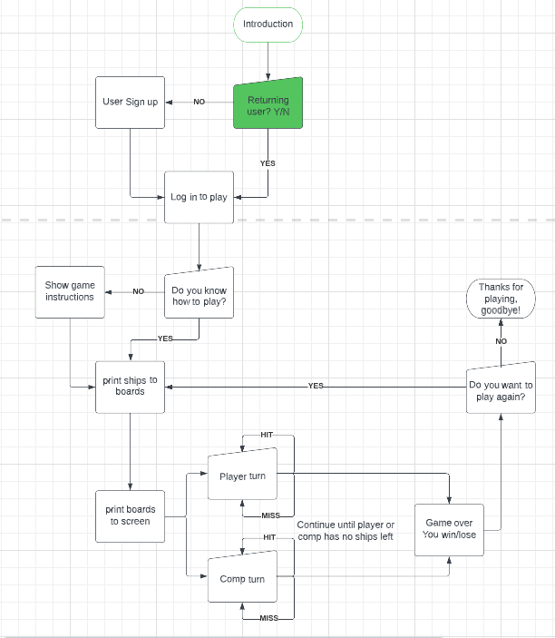

## Technologies Used

### Languages
- Python

### Frameworks, Tools & Libraries
- GitHub (saving and storing files)
- Gitpod (was the IDE used for writing the code)
- Python tutor (was used to find/fix errors in code)
- os module (used to clear the terminal window)
- random module (used to generate random numbers)
- time module (used for slow/fast typing effect and to add pauses in the code for better ux)
- sys module (used for typing effect and system exit to end game)
- Lucidchart (used to build flowchart for logic planing)
- Heroku (used to deploy the project)
- Google sheets API (used to store and check user input and authorise identity)
- Google OAuth (used to connect the project to the google account)

## Features

### Logo, returning user log in
- After the logo prints to the screen the user is asked if they are a returning user
- If Y then they are promted to log in
- If N they are prompted to sign up
- User stories covered: 2, 6

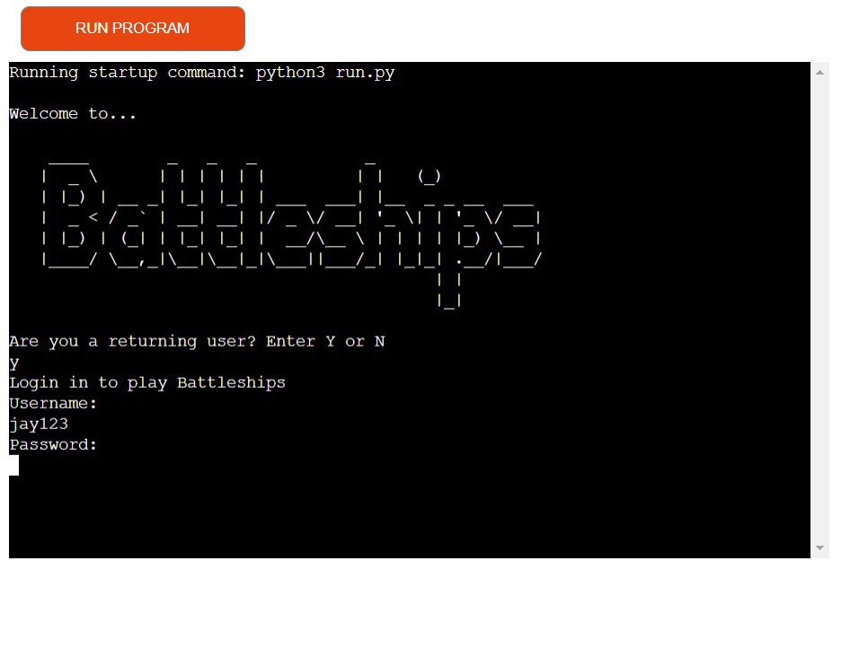

### Sign up prompt and instructions
- If the user is not a returning user then they are asked to sign up to play
- Followed by sign up instructions
- User stories covered: 1, 5

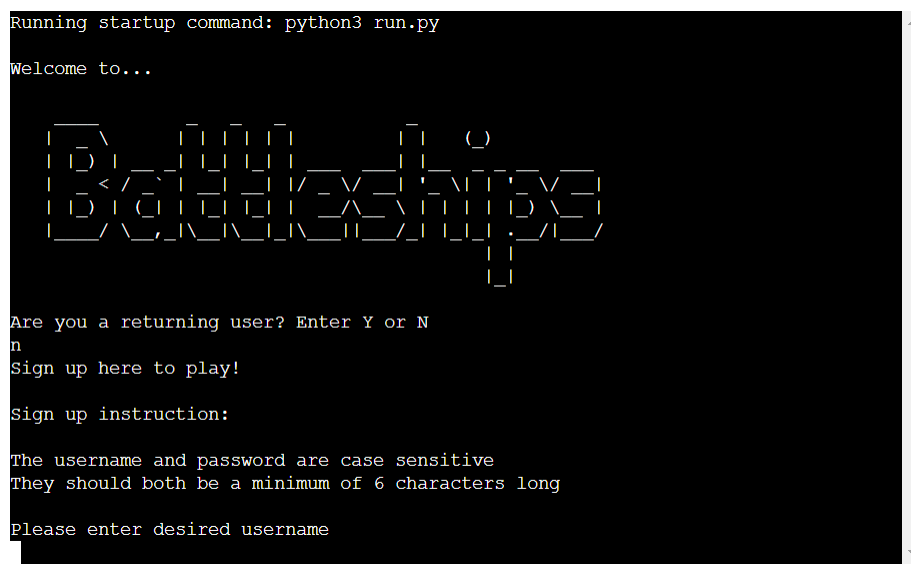

### Sign up confirmation, log in
- Once the user has created a username and password a message appears on screen confirming sign up success
- Followed by a prompt to log in using their new user and password.
- User stories covered: 7

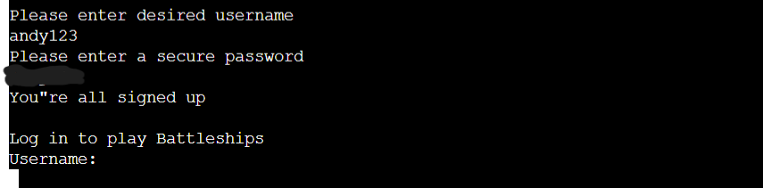

### Personalised welcome message
- Once log in is successful the user is presented a welcome message displaying their chosen username.
- User stories covered: 10

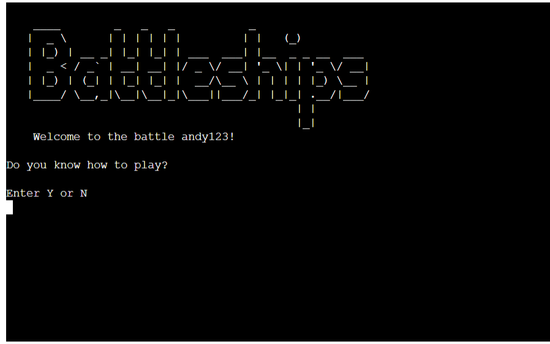

### Instructions
- User is asked if they know how to play
- If N then they are displayed the game instructions
- If Y then the ships are printed to the boards and boards printed to the screen to start the game.
- User stories covered: 3, 7

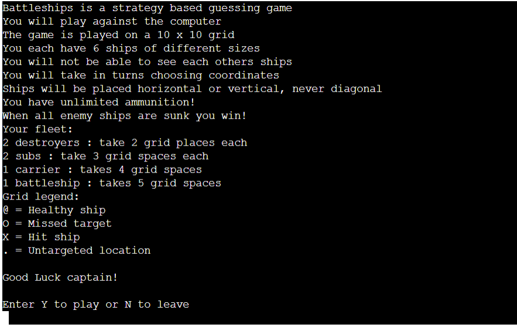

### Game boards
- Once user is ready to play the boards are printed to the screen.
- User stories covered: 7

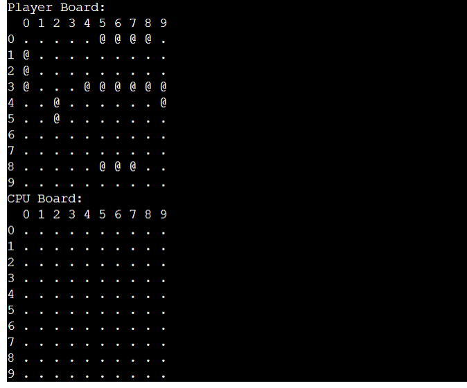

### User input and feedback
- After each turn the user recieves feedback on whether they hit the target or missed and whether the computer hit or missed.
- User stories covered: 7
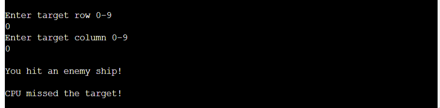

### Win/lose, play again message
- On game completion the user is displayed a win or lose message followed by asking if they want to play again.
- User stories covered: 9, 7, 4

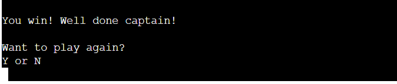

### Play again, boards reset
- If user decides to play again then the screen is cleared and new ships positions are printed to new game boards.
- User stories covered: 7, 4

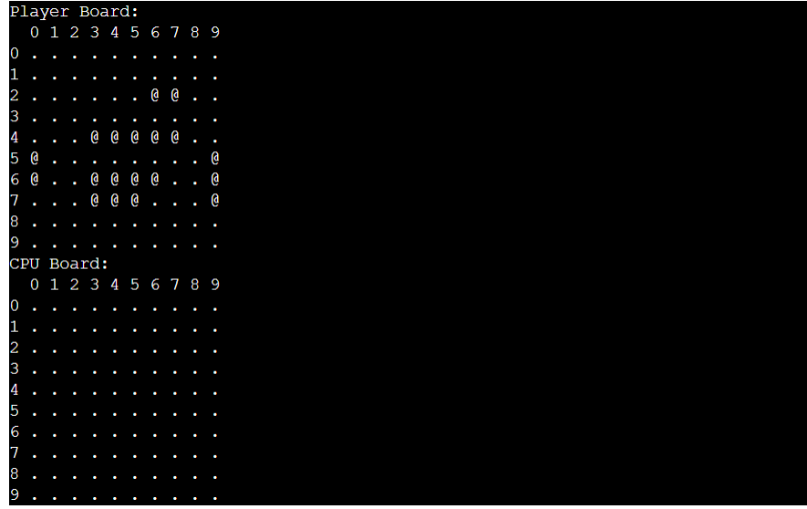

### Input validation
- If user inputs invalid data then they are notified with an error warning on screen asking to input valid data only.
- User stories covered: 8

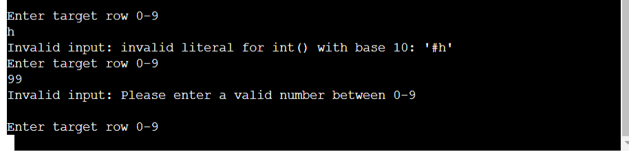

## Validation

### PEP8 Python linter
- [PEP8 Python Validator](https://pep8ci.herokuapp.com/) provided by Code Institute was used to lint the code.
- Sheet.py passes with no warnings or errors to show.
- Run.py has no errors and the warnings that are left are due to how the battleship logo is written but it has no effect on how the game or code runs.

    
sheet.py

    
Result: sheet.py

    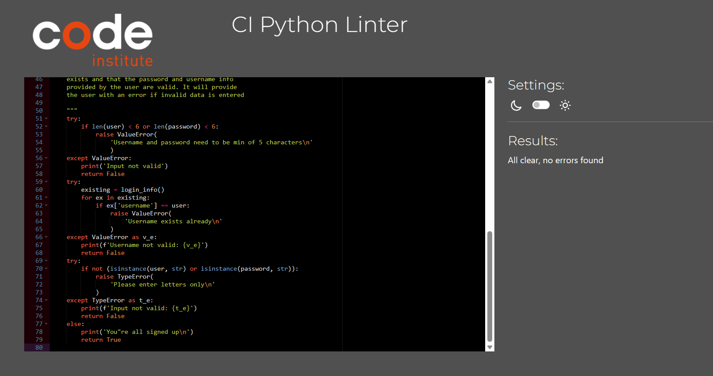

    
run.py

    
Result: run.py

    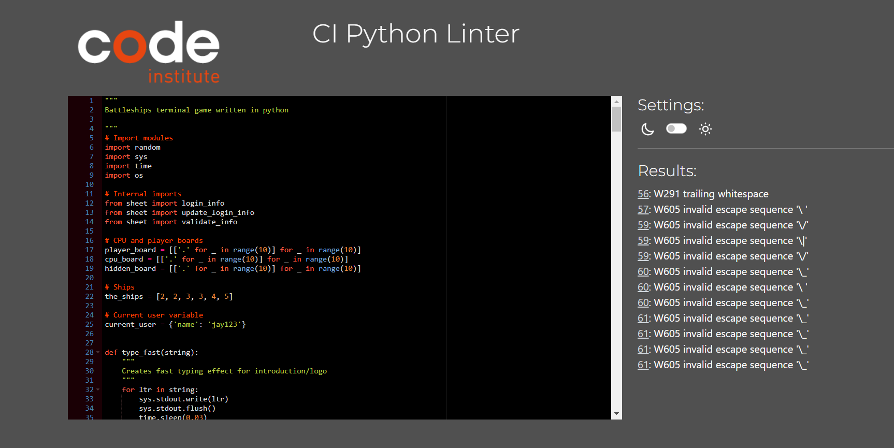

### Performing tests on various devices 
- acer aspire 3 
- The game is not designed for mobile or tablet use so has not been tested on other devices other than pc/laptop.

### Browser compatability
The website was tested on the following browsers:
- Google Chrome
- Microsoft Edge

### Testing user stories
1. I want to be able to sign up and create a username.

| **Feature** | **Action** | **Expected Result** | **Actual Result** |
|-------------|------------|---------------------|-------------------|
| Sign up | Select N when asked if returning user and follow sign up instructions | Take user through sign up process | Works as expected |

Screenshots

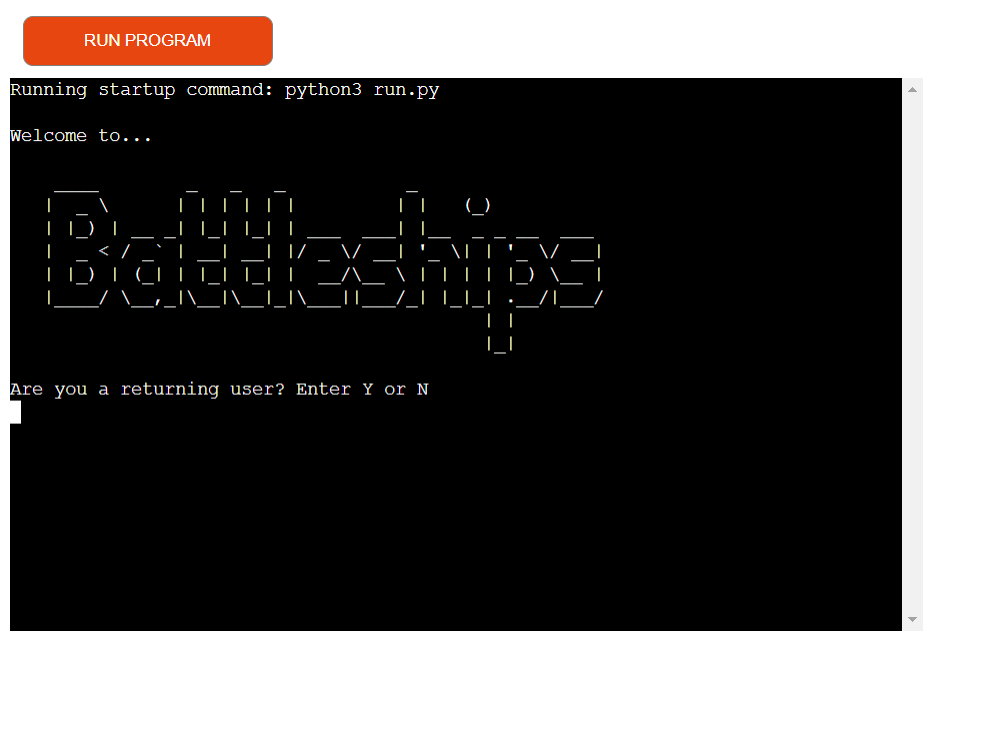

2. I want to be able to log in as a returning user.

| **Feature** | **Action** | **Expected Result** | **Actual Result** |
|-------------|------------|---------------------|-------------------|
| Returning user login | When asked if returning user select Y and enter login details where asked | Provide user a way to log into the game | Works as expected |

Screenshots

3. I want to see the game instructions before playing.
| **Feature** | **Action** | **Expected Result** | **Actual Result** |
|-------------|------------|---------------------|-------------------|
| Instructions | Select N when asked if know how to play | Display instructions to user | Works as expected |

Screenshots

4. I want the option to play again when the game ends.

| **Feature** | **Action** | **Expected Result** | **Actual Result** |
|-------------|------------|---------------------|-------------------|
| Play again | At end of the game user is asked if they want to play again and enter Y or N | Give user the option to play again | Works as expected |

Screenshots

5. I want new users to be able to sign up by creating a username and password.
| **Feature** | **Action** | **Expected Result** | **Actual Result** |
|-------------|------------|---------------------|-------------------|
| Sign up | Enter N when asked if returning user | Allow new users to sign up | Works as expected |

Screenshots

6. I want returning users to be able to log in using their chosen information.
| **Feature** | **Action** | **Expected Result** | **Actual Result** |
|-------------|------------|---------------------|-------------------|
| Returing user log in | Enter Y when asked if returning user | To allow the user to log in | Works as expected |

Screenshots

7. I want relative and constant feedback displayed to the user.

| **Feature** | **Action** | **Expected Result** | **Actual Result** |
|-------------|------------|---------------------|-------------------|
| User feedback | After each turn the user is given feedback on if they hit or missed and if the CPU hit or missed | Provide user with feedback during the game | Works as expected |

Screenshots

8. I want all input from the user to be validated to avoid errors.

| **Feature** | **Action** | **Expected Result** | **Actual Result** |
|-------------|------------|---------------------|-------------------|
| Input validation | When invalid data is entered the user gets an error message | To provide user with error message and avoid invalid data entries | Works as expected |

Screenshots

9. I want the user to be presented with a win or lose message on game completion.

| **Feature** | **Action** | **Expected Result** | **Actual Result** |
|-------------|------------|---------------------|-------------------|
| Win/Lose message | Win or Lose the game | Display a Win or Lose message to the user | Works as expected |

Screenshots

10. I want to provide a welcome message using the users chosen username.

| **Feature** | **Action** | **Expected Result** | **Actual Result** |
|-------------|------------|---------------------|-------------------|
| Welcome message | Log into game using your login details | Provide user with welcome message using their username | Works as expected |

Screenshots

## Bugs

| **Bug** | **Fix** |
| ----------- | ----------- |
| The boards were printing to the screen and starting the game before the user had chance to read the instructions | Add while loop to show instructions function so user has to enter Y when ready or N to leave the game |
| When user targets the same coordinates twice they are asked to try again but when new coordinates are entered the user seems to miss their go for that turn | Have not managed to fix this bug |

## Deployment
### Deploying in Heroku:
- The website was deployed to Heroko using following steps:
- Make an account on Heroko and login
- Create new app by clicking the new app option at the top right of the screen.
- Select your region.
- Then click "create app"
- Open the settings tab and click config vars:
  - Values are as follows:
    - KEY = CREDS /  VALUE = 'The contents of the creds.json file'
    - KEY = PORT /  VALUE = 8000
- Then add your build packs
  - Add python buildpack first
  - Add Nodejs buildpack after that
  - Must be python on top and Nodejs underneath
- Click the deploy tab
  - Choose deployment method
    - Connect to GITHUB
    - Login if prompted
- Connect to Github
  - Choose the repositories you want to connect
  - Click "Connect"
  - Automatic and Manual deploy
    - Choose a method to deploy
    - After you click deploy it will begin to build the app
- Final Deployment
  - A button to view will appear
  - Once clicked the app will open

### You can fork the repository by following these steps:
1. Go to the GitHub repository.
2. Click on Fork button in upper right hand corner.

### You can clone the repository by following these steps:
1. Go to the GitHub repository. 
2. Find the Code button above the list of files and click it. 
3. Select which you prefer, clone using HTTPS, SSH, or Github CLI and click the copy button to copy the URL.
4. Open Git Bash.
5. Change the current working directory to the one where you want the cloned directory.
6. Type git clone and paste the copied URL.
7. Press Enter to create your local clone.

## Credits
- Inspiration was taken from [Stack overflow](https://stackoverflow.com/), [pythondex](https://pythondex.com/) and [Copy assignment](https://copyassignment.com/)
- I found answers to lots of questions through the following sources:
  - [stack overflow](https://stackoverflow.com/)
  - The slack community
  - Google search
  - [code review.stack exchange](https://codereview.stackexchange.com/)

## Acknowledgements
I would like to take the opportunity to thank:
- My mentor Mo Shami for his advice, guidance and support during this project.
- My partner and friends for helping with testing and giving valuable feedback.
- Code Institute tutor support for their help and advice.
- The slack community as a whole for the support they provide.
 